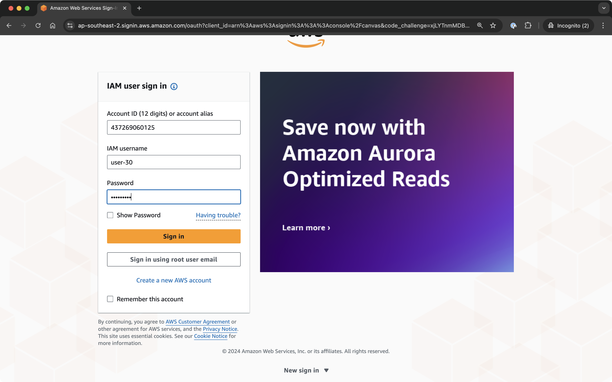
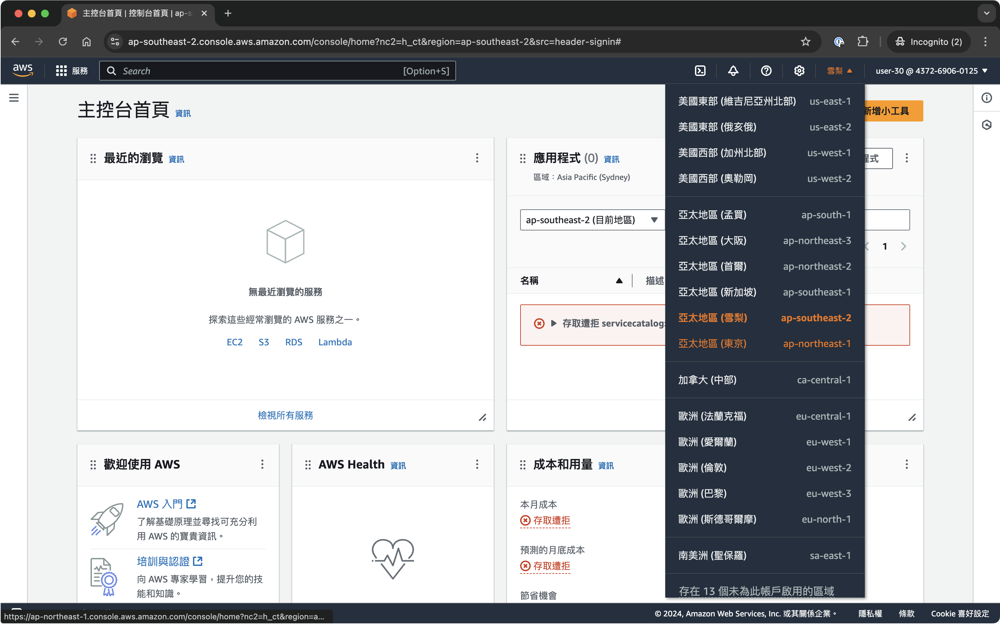
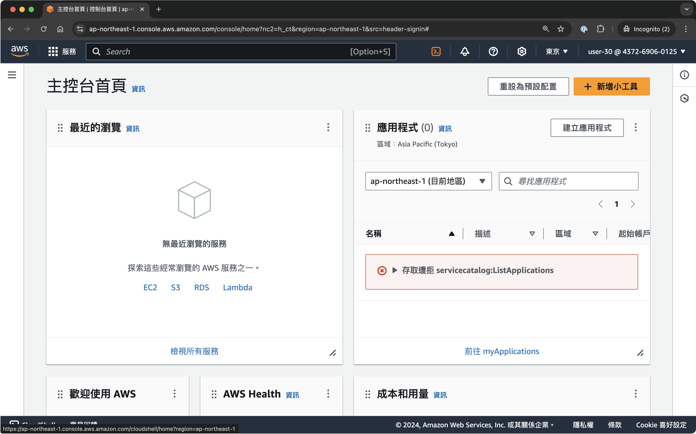
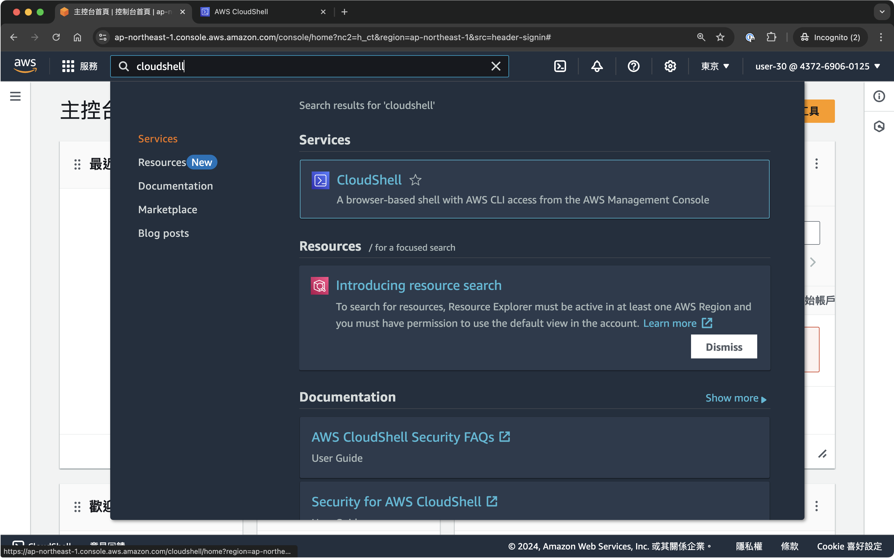

# k8s-for-developer

1. 至 AWS console 登入：https://437269060125.signin.aws.amazon.com/console

- username: `user-n`，請依據表單認領
- password: `123qwe!@#`



2. 登入後預設 region 可能不同，請依據 user-n 選擇對應 region。

- user-1 ~ user-8：ap-northeast-1
- user-9 ~ user-16：ap-northeast-2
- user-17 ~ user-24：ap-northeast-3



3. 確認 region。




4. 開啟 CloudShell 服務。



5. 使用以下 `aws sts get-caller-identity` 服務確認回傳 user name 為表單登記 user。


```bash
[cloudshell-user@ip-10-132-90-34 ~]$ aws sts get-caller-identity
{
    "UserId": "AIDAWLT2ELIOWY7SO2MLL",
    "Account": "437269060125",
    "Arn": "arn:aws:iam::437269060125:user/user-29"
}
```
